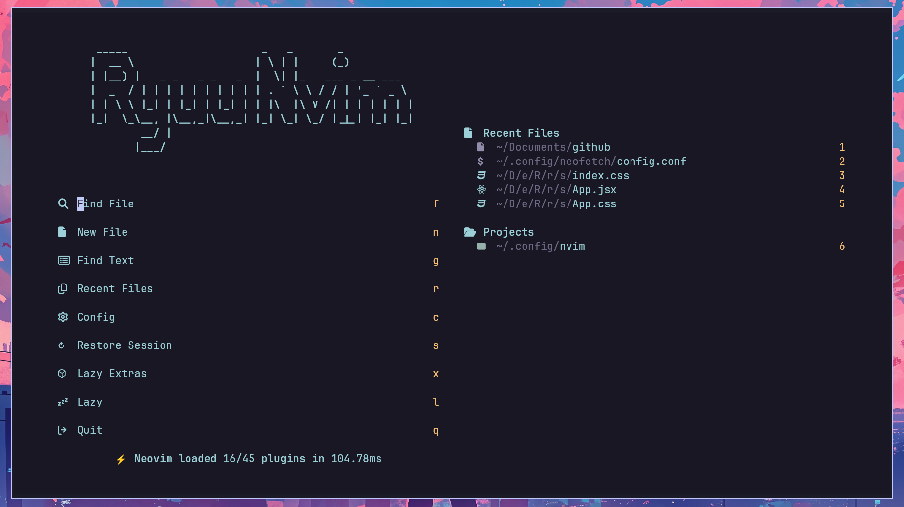
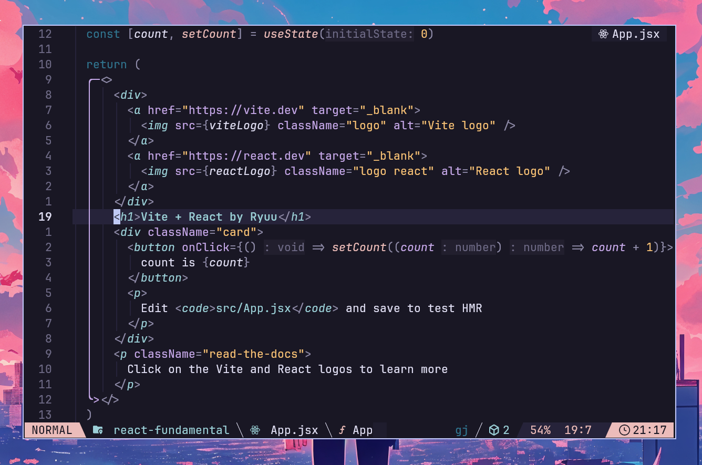

# My LazyVim Config

# Installation
WARNING : Backup your files first!

1. Clone this repo to your nvim config
```bash
git clone https://github.com/Ryuuusuke/LazyVim-conf.git ~/.config/nvim
```
2. Remove .git so you can upload it to your github
```bash
rm -rf .git
```
3.Done

## Preview


